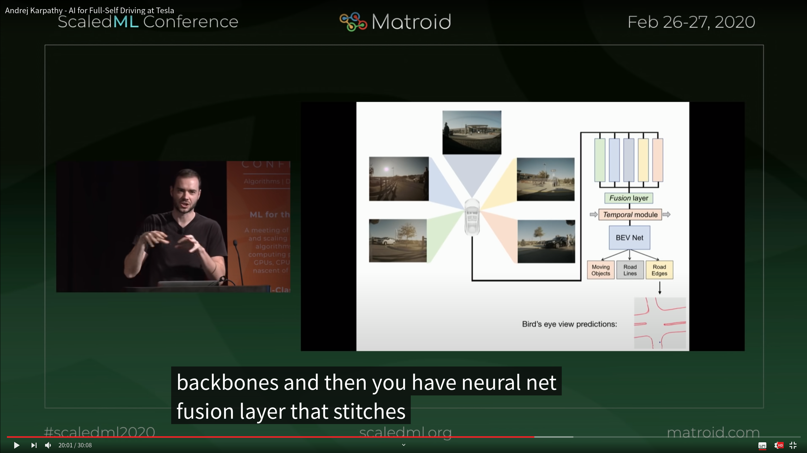
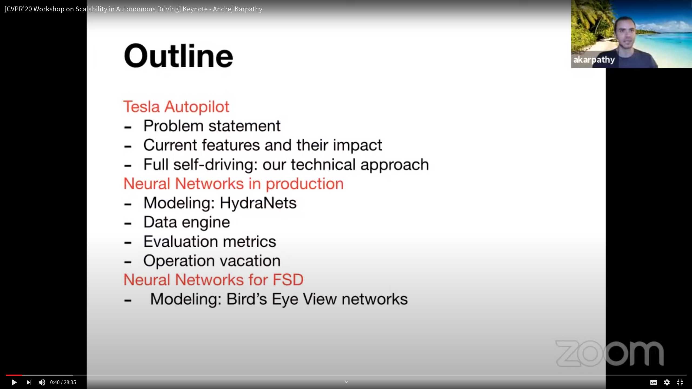
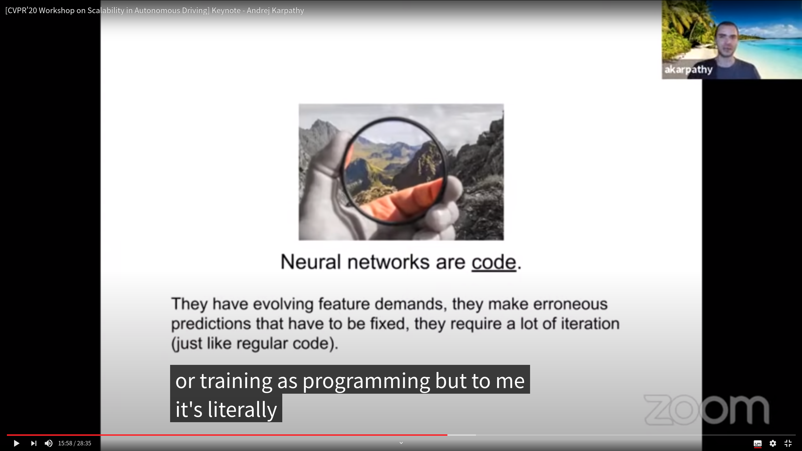
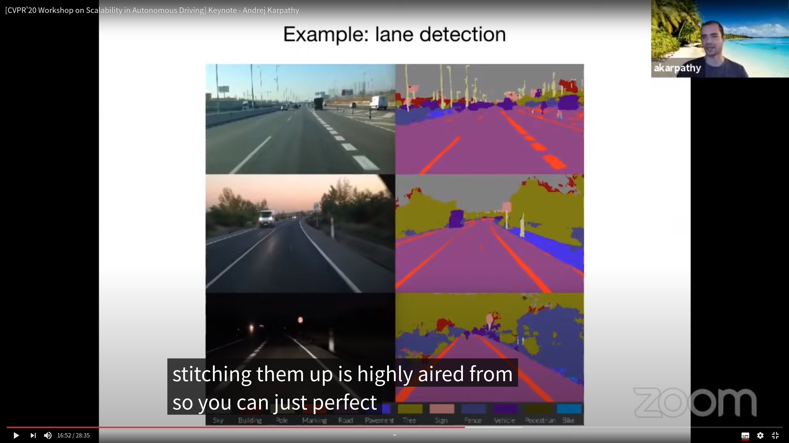
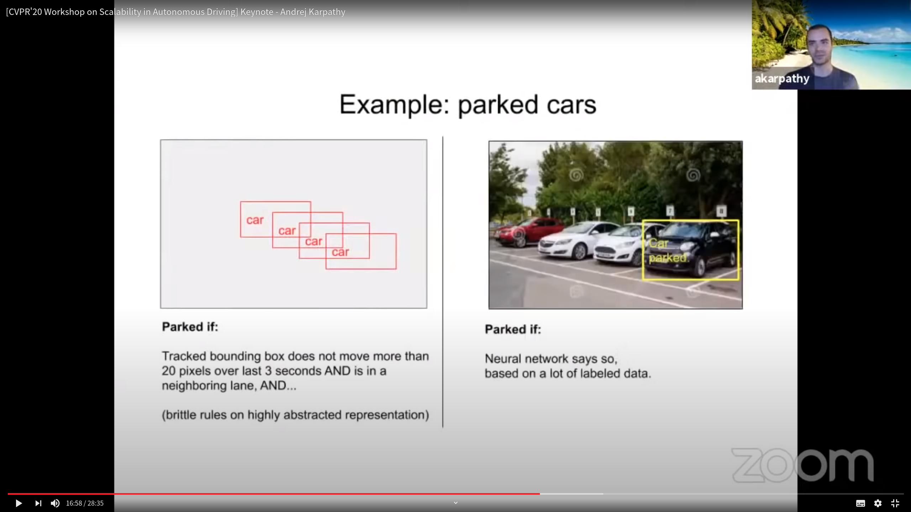
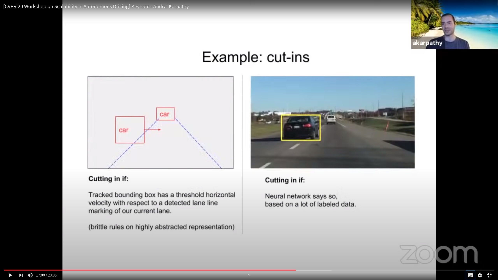
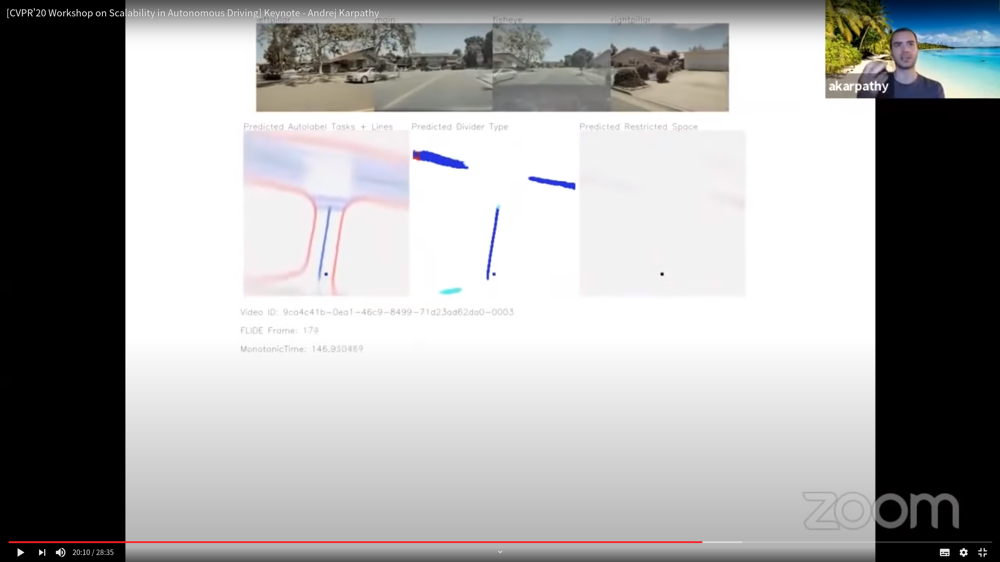
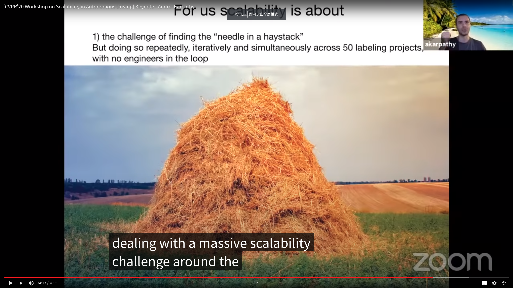
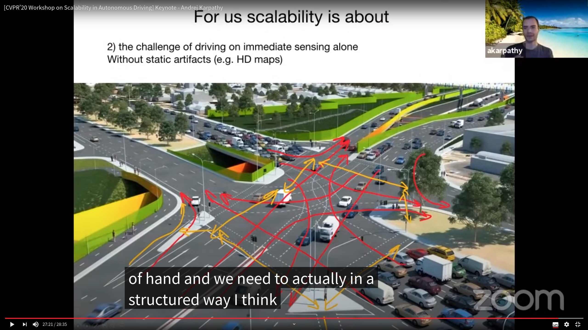

[TOC]

# Andrej Karpathy - AI for Full-Self Driving at Tesla

https://www.youtube.com/watch?v=hx7BXih7zx8

2020年4月20日

## Outline

1. What is Tesla Autopilot [1:20](https://www.youtube.com/watch?v=hx7BXih7zx8&t=80s) 
2. Tesla's methods are heavily based on computer vision rather than lidar [5:25](https://www.youtube.com/watch?v=hx7BXih7zx8&t=325s) 
3. Neural networks in production [6:55](https://www.youtube.com/watch?v=hx7BXih7zx8&t=415s) 
4. Receive training images for tricky cases from the fleet [8:35](https://www.youtube.com/watch?v=hx7BXih7zx8&t=515s) 
5. For testing, it is not enough to just rely on loss function and mean accuracy of test set [13:00](https://www.youtube.com/watch?v=hx7BXih7zx8&t=780s) 
6. HydraNet contains 48 networks with shared backbone, 1,000 distinct predictions (Number of output tensors) and it takes 70,000 GPU hours to train [14:12](https://www.youtube.com/watch?v=hx7BXih7zx8&t=852s) 
7. Neural networks for full self-driving [16:54](https://www.youtube.com/watch?v=hx7BXih7zx8&t=1014s) 
8. Get depth estimation from images directly by using self-supervised techniques [22:54](https://www.youtube.com/watch?v=hx7BXih7zx8&t=1374s), predict the depth, drive to it and measure the real distance 
9. other uses of self-supervised learning [25:24](https://www.youtube.com/watch?v=hx7BXih7zx8&t=1524s) 
10. Q&A [26:50](https://www.youtube.com/watch?v=hx7BXih7zx8&t=1610s) 

## Tesla Autopilot

主动安全 *注：在autopilot未启用时启动*。

Pedestrian AEB *注：Autopilot未启动*。

## Nerual Networks in Production

Autopilot检测的环境要素

Data Engine Process - Tesla自动模式部署与迭代。此循环会在Shadow mode上进行。对于一个corner case场景，Data Engine会记录其GPS并要求车队尽可能多的收集当前场景的数据。然后标注团队对齐进行标注，并自动触发离线训练。训练完成后，Data Engine会要求车队在shadow mode下在这个场景进行实际验证，并给出验证结果，如果结果足够好，则会在下一次OTA中部署到固件中。

借鉴传统软件开发中的测试驱动开发思想，对神经网络的各个任务进行单元测试。

如此大的一个网络，只是由 “a small elite team like a few dozen”维护。其搭建了一个强大的inferstructure团队维护基础设施，保证网络迭代的效率。

## Neural Networks for FSD

Road Edge Detecting Task - 基本上是一个binary segmentation task。

Detect in diffenrent camera, than project them out into 3d and stitch them up into "occupancy tracker". Stitch them up across images and across time. Talk中提到stitching is not a non-trivial task.

这是这哥们一直鼓吹的software2.0概念。其提到tesla上software2.0代码正在逐步替换掉software1.0代码。

其中提到当前大量的predition任务直接在BEV上进行。Take all this cameras, feed them to backbone, and then fusion layer stitches the feature maps across the different views and also does the projection from image space to BEV, and then temporal module, and then BEV net decoder to do different prediction.

Front view检测和BEV检测的对比。下左为真值，下右为front view检测和投影的效果，下中为BEV直接检测的结果。从下右中可以看出投影误差非常大，但是直接在BEV检测就没这个问题。

下边第一张图：road edges in red, diveders。第二张图，attributes for these dividers: actual curb or logical curb。第三张图：traffic flow direction(随着视角变化不断在变色，说明其方向与视角耦合)。

Predicting corridors in BEV. 红色为十字路口，小箭头为traffic flow的方向。

 上面为相机视角。中间为depth prediction - achieved by self supervised learning，作为psedou lidar。接着在depth点云上使用lidar 3d object detection算法。

由于深度图没法人工标注，所以他们使用了SOTA supervised techniques：当你有了深度后，你可以把某个pixel投影到不同视角或者历史、未来帧，然后利用photometric loss作为网络的loss，用于网络训练。

其中提到使用explicit preditions will be doomed to never be good enough and never be complete and writing these planners is extremely difficult error-prone, lots of hyper parameters. The logical conclusion is that we'd like to train nerual networks to do planning. And we have huge data sets of people driving cars as data labeling.

其中还提到他们还会更多依赖self supervised technique.

## Q&A

1. Tesla没有构建高精度地图，但是有在构建低精度地图，并在地图中收集stop sigh以及traffic lights等信息。低精度地图首先作为感知second layer。并且帮助系统trigger infrastructure for sourcing examples.

# Software 2.0

https://medium.com/@karpathy/software-2-0-a64152b37c35

* Software 1.0: rule-based
* Software 2.0: learning-based

## The benefits of Software 2.0

* **Computationally homogeneous**. much easier to make various correctness/performance guarantees.
* **Simple to bake into silicon**. easier to implement these networks much closer to silicon, e.g. with custom [ASICs](https://www.forbes.com/sites/moorinsights/2017/08/04/will-asic-chips-become-the-next-big-thing-in-ai/#7d6d7c0511d9), [neuromorphic chips](https://spectrum.ieee.org/semiconductors/design/neuromorphic-chips-are-destined-for-deep-learningor-obscurity), and so on. 
* **Constant running time**. 
* **Constant memory use**. 
* **It is highly portable**.
* **It is very agile**. easy to tune the system. remove half of the channels, retrain, and there — it runs exactly at twice the speed and works a bit worse. 
* **Modules can meld into an optimal whole**. easy to do transfer learning
* **It is better than you**. 

## The limitations of Software 2.0

it's very hard to tell why.

## Programming in the 2.0 stack

If you recognize Software 2.0 as a new and emerging programming paradigm instead of simply treating neural networks as a pretty good classifier in the class of machine learning techniques, the extrapolations become more obvious, and it's clear that there is much more work to do.

In the 2.0 stack, the programming is done by accumulating, massaging and cleaning datasets. Therefore we should build tools to help with all of the workflows in accumulating, visualizing, cleaning, labeling, and sourcing datasets.

# Andrej Karpathy: Tesla Autopilot and Multi-Task Learning for Perception and Prediction

https://www.youtube.com/watch?v=IHH47nZ7FZU&t=139s

主要讲Multi-Task Learning实际训练过程中的一些挑战，只是抛出了问题，并没有给出解答：

## Outline

Clips from Andrej Karpathy's talk at ICML (June 2019). Here's the outline: 

 -  [0:00](https://www.youtube.com/watch?v=IHH47nZ7FZU&t=0s) - Sensors；
 -  [0:29](https://www.youtube.com/watch?v=IHH47nZ7FZU&t=29s) - Single-task learning challenges：场景太多，无法覆盖全；
 -  [4:35](https://www.youtube.com/watch?v=IHH47nZ7FZU&t=275s) - Multi-task neural network architecture： 同时运行多个单任务网络的问题是计算效果过低，因此需要多任务网络。然后有些任务在同一个网络中会互相促进，另一些则会互相影响，决定将哪些网络的哪些层共享，甚至是哪路相机共享网络都是需要考虑的问题；
 -  [11:50](https://www.youtube.com/watch?v=IHH47nZ7FZU&t=710s) - Loss function considerations：如何确定各个task对应的loss的权重是一个需要考虑的问题；
 -  [14:34](https://www.youtube.com/watch?v=IHH47nZ7FZU&t=874s) - Training dynamics：数据分布的比例不同，如何在训练时确定各类数据的采样权重？当考虑early stopping时，不同的task overfit的时间不一样，如何确定训练什么时候该结束？
 -  [18:25](https://www.youtube.com/watch?v=IHH47nZ7FZU&t=1105s) - Team workflow：不同的task由不同的人在own，因此会存在资源争抢的问题，如何平衡？

# [CVPR'20 Workshop on Scalability in Autonomous Driving] Keynote - Andrej Karpathy

https://www.youtube.com/watch?v=g2R2T631x7k

2020年6月18日

## Outline

1.  What is Tesla Autopilot [1:13](https://www.youtube.com/watch?v=g2R2T631x7k&t=73s) 
2. Tesla's methods are heavily based on computer vision rather than lidar [4:22](https://www.youtube.com/watch?v=g2R2T631x7k&t=262s) 
3. Neural networks in production [6:34](https://www.youtube.com/watch?v=g2R2T631x7k&t=394s) -Receive training images for tricky cases from the fleet [10:03](https://www.youtube.com/watch?v=g2R2T631x7k&t=603s) 
4. HydraNet contains 48 networks with shared backbone, 1,000 distinct predictions ([#output](https://www.youtube.com/results?search_query=%23output) tensors) and it takes 70,000 GPU hours to train [13:15](https://www.youtube.com/watch?v=g2R2T631x7k&t=795s) 
5. Neural networks for full self-driving [15:28](https://www.youtube.com/watch?v=g2R2T631x7k&t=928s) -They don't treat lane detection as a segmentation task [16:25](https://www.youtube.com/watch?v=g2R2T631x7k&t=985s) 
6. Summary [24:04](https://www.youtube.com/watch?v=g2R2T631x7k&t=1444s)

## Spotlight

Neural networks are code. Software2.0.

You don't treat lane detection as a segmentation task. 其中提到虽然在图像上检测效果看起来不错，但是投影到3d空间中很可能不好，这才是最难的部分。这里暗示了其lane detection可能end to end检测出3d车道线。

检测停止的车辆直接由网络给出，而不是通过2d detection加一系列逻辑得到。

Cut-in 直接由网络给出。

预测十字路口

如何理解scalability

